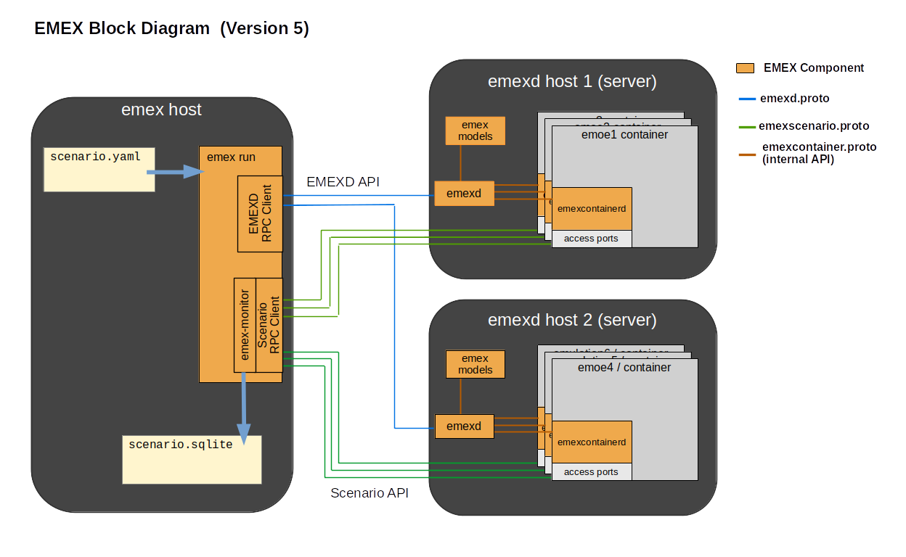
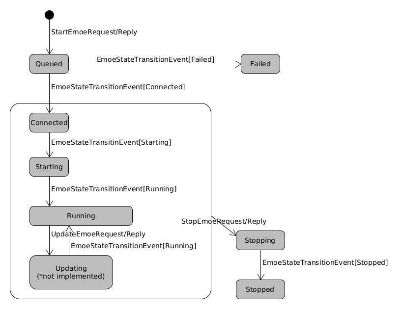
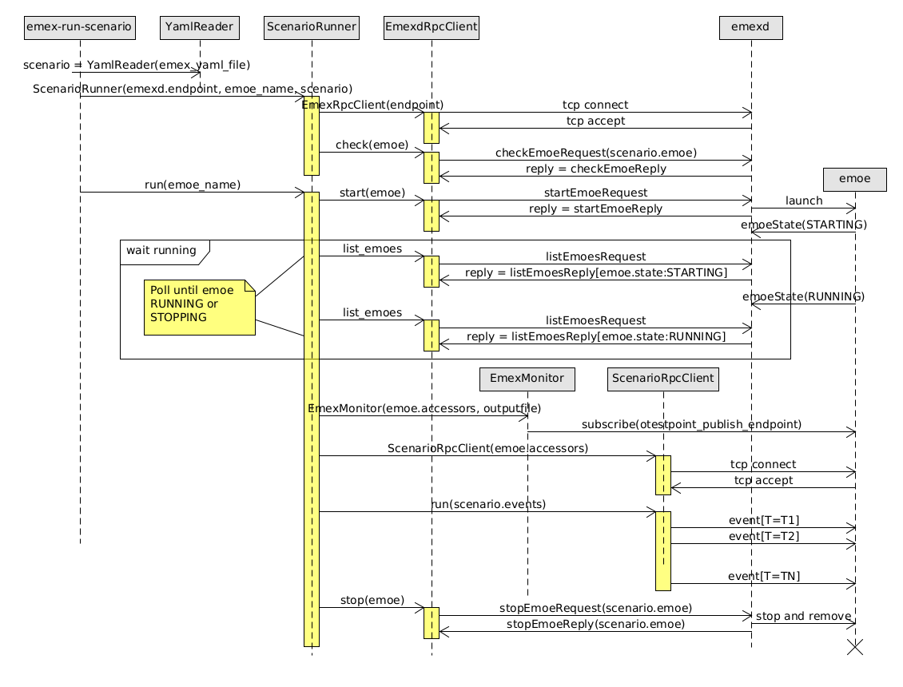
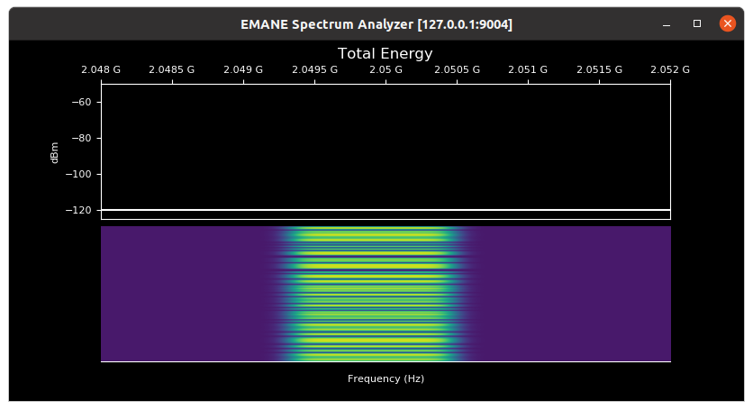
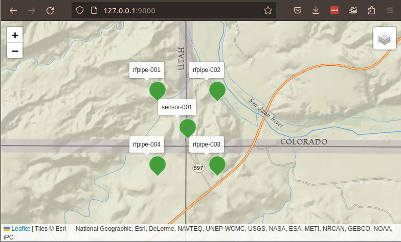

# EMEX

The EMulation EXecutor (EMEX) project aims to simplify and automate
EMANE emulation execution. An EMEX client interacts with a server via
the EMEXD API and Scenario API to run one or more (concurrent)
emulations --- up to the limits of the server's resources.  Both APIs
are defined in a Google protocol buffer description file
[emex/emexd.proto](emex/emexd.proto) and
[emex/emexscenario.proto](emex/emexscenario.proto).

EMEX sees an EMANE emulation as two distinct parts, the
Electro-Magnetic Operating Environment (EMOE) and the Scenario.  The
EMOE describes the participants of the emulation, the Platforms that
model physical RF emitting/receiving entities (radios, vehicles,
airplanes, towers, satellites, etc) and their configurations. The Scenario
describes the dynamic, time sequenced events of the emulation,
especially platform motion, antenna pointing and communication traffic
flows. Using the analogy of a chess game, the EMOE sets up the board
and the Scenario plays the game. Each EMOE is executed within
a Docker container. Multiple EMOEs may run in parallel on the same
server.

This project contains the EMEX software.

 * The EMEX Daemon (`emexd`) which runs on an EMEX server and manages
   EMOEs on behalf of a client.
 * An example EMEX Client (`emex`) which can either run an emulation
   based on a YAML file definition, or interact with the Daemon from
   a shell to create an EMOE and interact with it on the fly.
 * The EMEX Container Daemon (`emexcontainerd`) which resides within
   each EMOE container instance and orchestrates the associated EMOE
   applications in conjunction with its controlling `emexd`
 * A Model Repository containing standardized EMANE waveform model
   configuration and platform type definitions.

{#emex-block-diagram}

## Design Overview

EMOEs are constructed from EMEX Types. There are currently two:

A *PlatformType* notionally maps to a physical entity in the EMOE ---
a handheld radio, a terrestrial or airborne vehicle or a communications
tower (for example). A *PlatformType* may contain one or more Spectrum
Dependent Systems (SDS) sub-components which move together when the
containing *PlatformType* moves. Each SDS is modeled by a
*WaveformType* which maps one-to-one with an underlying EMANE Radio
Model. Each *PlatformType* includes its *WaveformTypes* as
configurable (sub) *Components*. For example, the `scr_rfpipe`
*PlatformType* models a Single Channel Radio (SCR) running the
the RFPipe open source radio model.

Each *Component* contains configurable parameters organized in
groups. Most of the parameters have sensible defaults to simplify
construction. Creating a *Platform* instance from a *PlatformType*
requires uniquely naming the *Platform* and (optionally) specifying
values for *Component* parameters. Helper classes automatically
assign values for IP addresses or NEM IDs on EMOE creation if
the user has not done so manually.

An *AntennaType* names a directional antenna type that can be used to
specify a gain pattern at all elevations and bearings relative to the
Platform's orientation - see the description of the
[EMANE Antenna Profile](https://github.com/adjacentlink/emane/wiki/Antenna-Profile).
An *Antenna* can be added to the EMOE from an *AntennaType* by specifying
values for its parameters - for example a sector antenna can be built
by defining the antenna's horizonal and vertical beam width. Each
defined *Antenna* must be given a unique name and this name is used
to assign the antenna to a particular *Component*. All SDSs default to an ideal
omni-directional antenna when none is specified.

Initial conditions may be assigned to each EMOE Platform to include
the Platform's initial position, orientation and velocity (POV),
bidirectional pathloss settings to other Platforms or initial antenna
pointing (azimuth and elevation) for each of the Platform's
components.

At startup, the EMEX client queries the server for available types from the
Model Repository via the `ModelTypesRequest` message.

In the EMEXD API an EMOE instance is the fundamental transactional
element between clients and servers. Each EMOE is in one of nine
states:

{#emex-state-diagram}


1. QUEUED: emexd place an EMOE into the QUEUED state on reception
           of a valid `StartEmoeRequest` message
           for an EMOE that can be provisioned with current
           resources. The request is enqueued to a separate
           worker thread that executes the call to start
           the EMOE container. Start requests are serviced
           in FIFO order.

2. CONNECTED: The EMOE enters the CONNECTED state when the
              `emexcontainerd` instance in the EMOE container
              establishes connection back to the controlling
             `emexd`.  It signals that the EMOEs container
              successfully launched.

3. STARTING: After connecting to the controlling emexd instance,
             `emexcontainerd` orchestrates the intantiation of the
             EMOE nodes and applications that comprise the
             scenario within the EMOE container. The STARTING state
             spans the duration of this process - from container
             launch to all applications ready for scenario input.

4. RUNNING: The EMOE enters the RUNNING state once of the emulation
            applications are up and running and the EMOE is ready
            to accept scenario inputs.

5. UPDATING: Placeholder state for a planned future capability for
             allowing new platforms to be added to a running
             EMOE. This is not currently implemented.

6. STOPPING: An EMOE enters the STOPPING state triggered by a
             `StopEmoeRequest`. During this stopping state, the EMOE
             applications are halted and the EMOE container
             is stopped and removed. The EMOE STOPPING state is
             signaled by `StopEmoeReply[result=PASS]` or by an
             `EmoeStateTransitionEvent[state=STOPPING] in case of an
             internal error.

7. STOPPED: An EMOE enters the STOPPED state once it's container has
            been stopped and removed. The EMOE STOPPED state is
            signaled by an `EmoeStateTransitionEvent[state=STOPPED]`
            event or determined via polling with listEmoes. Any EMOE
            that is no longer among the entries in a listEmoesReply is
            also implicitly in the STOPPED state.

8. FAILED: An EMOE enters the FAILED state from the QUEUED state
           when emexd is unable to start the EMOEs container.


Once an EMOE reaches the RUNNING state, it opens control and monitor
endpoints for control and monitoring by the client. These *accessors*
endpoints are signaled from the Daemon to the Client in
`listEmoesReply` message. The `emexcontainerd` endpoint is the access
point for controlling Platform traffic flows, position, antenna
pointing and pair-wise pathloss. These manipulations are performed via
the Scenario API messages defined by emexscenario.proto.

The EMOE lifecycle then is characterized by an initial transaction to
start the EMOE via the EMEXD API, a period of runtime manipulations
via the Scenario API and finally stopping the EMOE again via the
EMEXD API. The following diagram illustrates this sequence
orchestrated by the `emex run` command discussed later.

{#emex-lifecycle-sequence}


## Getting Started

The current release includes `emexd` and `emexcontainerd` and the
sample client, `emex`. The `emex shell` command opens a shell to
dynamically interact with an `emexd` instance to start and stop
EMOEs. It will eventually be updated to interface with individual
EMOEs over the Scenario API and direct runtime scenario events.

The `emex run` command executes an EMANE emulation from a user
provided EMEX YAML file taken as input. The YAML file specifies the
emulation platforms, their initial conditions (optional)
and time-based commands that define the scenario's runtime traffic
flows and mobility.

### emexd

The listing below shows `emexd.xml`, the example `emexd` configuration
file included with the release. It installs to
`PYTHONPATH/emex/emexd.xml`. The file may be passed to emexd as a
command line argument or be placed at /etce/emexd.xml. The
configuration file is not required and the values listed are the
defaults.


---

```XML
<!-- Example emexd configuration file showing defaults.  Pass to emexd
     with the -c option or place it at /etc/emexd.xml. -c option
     takes precedence over /etc/emexd.xml. emexd runs with the
     default values when no configuration file is provided. -->
<emexd>
  <!-- emexd endpoint for listening for client connections -->
  <client-listen address="127.0.0.1" port="49901"/>

  <!-- emexd endpoint for listening for container connections.
       uses the default docker0 address -->
  <container-listen address="172.17.0.1" port="49902"/>

  <!-- disable asynchronous state messages to clients. this should
       be false for all provided emex clients which operate in
       strict request/response order. -->
  <state-messages enable="false"/>

  <!-- specify as a range the cpus on the system available for allocating
       for containers. the maximum emexd will attempt to use
       is "1-MAXID" where MAXID is the max cpu id on the system.
       By default will use MAXID/4 to MAXID. Uncomment and change
       to a valid range on your system to customize.
  <allowed-cpus ids=""/>
  -->
  <!-- specify the host ports that emexd will bind to container ports
       to connect to clients -->
  <allowed-host-ports ports="9000-9999"/>

  <!-- use the named docker image to run EMOEs -->
  <docker-image name="emex:@VERSION@"/>

  <!-- emexd logging level, one of debug,info,warning or error -->
  <emexcontainerd-loglevel level="info"/>

  <!-- At startup and shutdown, stop and remove all containers with
       image name starting with "emex" (when set to true). When set to false,
       only stop and remove the containers controlled by this emexd instance
       at shutdown - the user may need to handle any orphaned
       containers separately. -->
  <stop-all-containers enable="true"/>

  <!-- emexd creates a subdirectory in /tmp/emex for each EMOE
       executed. the directory contains configuration and output artifacts -
       logs and raw data.  at the end of the scenario, emexd will keep or
       delete this directory as directed by this parameter - one of
       keep,delete,deleteonsuccess. The last setting will only delete the
       emex directory after a scenario that completes successfully, to help
       preserve artifacts to troubleshoot possible scenario errors.
       containers. -->
  <emexdirectory action="keep"/>

  <!-- One of {none, prefix, suffix}. emexd will form an EMOE container
       name with the EMOE ID and the EMOE name specified by the client when
       set to "prefix" or "suffix" - the ID is prepended/appended to the name
       accordingly. When set to none, the EMOE container name is the EMOE
       name set by the client. prefix is the default. -->
  <container-datetime-tag format="prefix"/>
</emexd>
```

---


The `-h` option lists `emexd` command line options. `emexd` runs in
the foreground if no arguments are provided.

---

```
[user@host]$ emexd -h
usage: emexd [-d] [-p PIDFILE] [-c CONFIGFILE] [-f LOGFILE] [-l LOGLEVEL]

options:
       -d:            run as daemon
       -p PIDFILE:    specify a pidfile
       -c CONFIGFILE: specify the emexd configuration file
       -f LOGFILE:    specify the emexd log file
       -l LOGFILE:    specify the log level, one of critical,
                      error, warning, info, debug, notset.
                      Default: info

[user@host]$ emexd
10:54:59.218 INFO: importing Plugin from waveform_resource.plugins.emex.emexd
10:54:59.218 INFO: initializing service
10:54:59.218 INFO: initialize
10:54:59.218 INFO: client_address=127.0.0.1
10:54:59.218 INFO: client_port=49901
10:54:59.218 INFO: container_address=172.17.0.1
10:54:59.218 INFO: container_port=49902
10:54:59.218 INFO: state_messages_enable=False
10:54:59.218 INFO: allowed_cpus={4, 5, 6, 7, 8, 9, 10, 11, 12, 13, 14, 15}
10:54:59.218 INFO: allowed_host_ports bounds [9000, 9999]
10:54:59.218 INFO: docker_image=rockylinux.emex
10:54:59.218 INFO: emexcontainerd_loglevel=info
10:54:59.218 INFO: stop_all_containers=True
10:54:59.218 INFO: listening for clients on 127.0.0.1:49901
10:54:59.218 INFO: listening for containers on 172.17.0.1:49902
10:54:59.220 INFO: starting service
10:54:59.220 INFO: stopping all existing emex containers
10:54:59.221 INFO: main thread waiting
```

emexd (server) and emex (client) are written generally to run on separate
hosts where (primary use case) the server is a headless, CPU rich machine.
Frequently though they are run on the same machine.

`emexd` listens for clients on port 49901 by default. Additionally,
each EMOE container opens endpoints from a pool of ports allocated to
the controlling `emexd` via configuration (`allowed-host-ports`) - the
default range for these is [9000, 9999]. Currently each EMOE requires
a minimum of 4 ports.

Firewall rules may need to be changed to allow client/server
transactions on these ports. See [Troubleshooting Notes](#troubleshooting-notes)
later.


---

### emex run

`"emex run"` runs the emulation described by the EMEX YAML input
file. After the `name` and `description` elements for naming and
describing the scenario, the YAML file contains two main
sections. Follow along with the RF Pipe YAML example below when
reading through the format description.

The `emoe` section contains up to three subsections. The `platforms`
subsection, the only one required, names the platforms that comprise
the EMOE. Each platform entry starts with a unique platform name
followed by fields for it's platform type (`type` - required) and a
set of parameter value assignments (`parameters` - optional).

The optional `antennas` subsection lists uniquely named antennas
generated from the Model Repository *AntennaTypes* by specfiying
values for the type's parameters. Assign an antenna to a platform by
name. Platforms default to use an ideal omni-directional antenna with
0db gain. The `omni` antenna name is available without specifying an
`antennas` entry and can be augmented with a gain value when specified
as `omni_GAINVALUE`, see the example below.

Use the optional `initial_conditions` subsection to assign initial position, orientation and velocity (`pov`),
pairwise `pathloss` or `antenna_pointing` (azimuth and elevation) to
any of the platform components. The definitions of these entries follows
closely from the underlying [EMANE meaning for these values.](https://github.com/adjacentlink/emane/wiki/EEL-Generator)
The format for each of the initial condition entries is described later in the
[YAML Scenario Sentence Formats](#yaml-scenario-sentence-formats) section. The initial conditions
formats duplicate the format used in the YAML `scenario` sections except
for breaking out the initial condition type to group the initial conditions
(`pov`, `pathloss`, `antenna_pointing`).

One import note on initial conditions. EMOE platforms are set to use the [EMANE freespace propagation model](https://github.com/adjacentlink/emane/wiki/Physical-Layer-Model#propagationmodel)
by default, where pathloss between nodes is calculated from the
distance between the nodes as set by their `pov` values. In this
case, `pathloss` values passed as `initial_conditions` or in
the `scenario` section are ignored. The example YAML file below
demonstrates setting the EMANE propagation model to *precomputed*
where the pathloss settings are used instead (and are required
for any traffic to pass between platforms). For this setting,
the `pov` values are optional but, when specified, are
used to calculate propagation delay between platforms. Propagation
delay is 0 otherwise.

The `scenario` section defines the time-based scenario events. Each event
starts with the scenario time of execution with reference to T=0 as
the time the EMOE starts running. The `scenario` block can include the `initial_conditions`
event types as well as traffic events (`flow_on`, `flow_off`) and jamming
events for jammer platforms (`jam_on`, `jam_off`). [YAML Scenario Sentence Formats](#yaml-scenario-sentence-formats)
details the format of each event.


---

```
name: demo.rfpipe
description: |
    Four rfpipe nodes in a square with a sensor node at the center.

            1 --- 2
            |     |
            |  s  |
            |     |
            4 --- 3

    node 1, 3 and 4 are configured with a directional antenna,
    "sector_60_by_30_3dB" and node 2 has an omni with 20dB gain,
    "omni_20.0".

    While the node locations determine propagation delays between
    nodes, the demo is configured with propagationmodel=precomputed,
    which means the pathloss between nodes is set by the intial_conditions
    and scenario "pathloss" statements explicitly set the channel
    loss between nodes. This contrasts to "freespace", the default
    progagation model where pathloss is deterimend by inter-node
    distance and the transmitter frequency. The pathloss is set to
    90dB along the sides of the square and 120dB along the diagonals.

    rfpipe-001 and rfpipe-003 are initially pointed towards
    rfpipe-002.  rfpipe-004 is pointed towards rfpipe-003, which will
    not receive it (since it is pointing north).

    T=20 set all nodes to transmit multicast to all other nodes 5 times
         per second with randomized transmit times.

    T=40 start a unicast traffic flow from rfpipe-001 to rfpipe-002 and
         antenna pointing are changed so rfpipe-001 and rfpipe-003 are
         pointed towards rfpipe-004. rfpipe-004 is pointed diagonally
         across the square towards rfpipe-002.

    T=60 the pathloss between rfpipe-001 and rfpipe-004 is increased to
         200 to break the link.

    T=80 all nodes move one position clockwise. Antenna pointings are
         changed so that all nodes point at rfpipe-002.

    T=110 all flows are stopped

    T=120 end the scenario

emoe:
    antennas:
        sector_60_by_30_3dB:
            type: sector
            parameters:
                gain: 3.0
                horizontal_beamwidth: 60.0
                vertical_beamwidth: 30.0
    platforms:
        rfpipe-001:
            type: scr_rfpipe
            parameters:
                r1.rm.rxfrequency: 2050000000
                r1.rm.txfrequency: 2050000000
                r1.rm.txpower: 20.0
                r1.phy.propagationmodel: precomputed
                r1.phy.antenna0: sector_60_by_30_3dB
        rfpipe-002:
            type: scr_rfpipe
            parameters:
                r1.rm.rxfrequency: 2050000000
                r1.rm.txfrequency: 2050000000
                r1.rm.txpower: 20.0
                r1.phy.propagationmodel: precomputed
                r1.phy.antenna0: omni_20.0
        rfpipe-003:
            type: scr_rfpipe
            parameters:
                r1.rm.rxfrequency: 2050000000
                r1.rm.txfrequency: 2050000000
                r1.rm.txpower: 20.0
                r1.phy.propagationmodel: precomputed
                r1.phy.antenna0: sector_60_by_30_3dB
                r1.phy.antenna0_east: 5
        rfpipe-004:
            type: scr_rfpipe
            parameters:
                r1.rm.rxfrequency: 2050000000
                r1.rm.txfrequency: 2050000000
                r1.rm.txpower: 20.0
                r1.phy.propagationmodel: precomputed
                r1.phy.antenna0: sector_60_by_30_3dB
                r1.phy.antenna0_north: 10
        sensor-001:
            type: h_spectrum_monitor
            parameters:
                r1.phy.propagationmodel: precomputed

    initial_conditions:
        pov: |
            rfpipe-001  37.005 -109.050 3.0
            rfpipe-002  37.005 -109.040 3.0
            rfpipe-003  36.995 -109.040 3.0
            rfpipe-004  36.995 -109.050 3.0
            sensor-001  37.000 -109.045 3.0
        pathloss: |
            rfpipe-001  rfpipe-002:90 rfpipe-003:120 rfpipe-004:90  sensor-001:80
            rfpipe-002                rfpipe-003:90  rfpipe-004:120 sensor-001:80
            rfpipe-003                               rfpipe-004:90  sensor-001:80
            rfpipe-004                                              sensor-001:80
        antenna_pointing: |
            rfpipe-001  90.0 0.0
            rfpipe-003   0.0 0.0
            rfpipe-004  90.0 0.0


scenario:
    20.0: |
        flow_on name=SA source=rfpipe-* destination=rfpipe-* proto=multicast ttl=4 periodic 5.0 512
    40.0: |
        flow_on name=flow1 source=rfpipe-001 destination=rfpipe-002 proto=udp periodic 10.0 256
        antenna_pointing rfpipe-001  180.0 0.0
        antenna_pointing rfpipe-003  270.0 0.0
        antenna_pointing rfpipe-004   45.0 0.0
    60.0: |
        pathloss  rfpipe-001  rfpipe-002:90 rfpipe-003:120 rfpipe-004:120 sensor-001:80
        pathloss  rfpipe-002                rfpipe-003:90  rfpipe-004:120 sensor-001:80
        pathloss  rfpipe-003                               rfpipe-004:90  sensor-001:80
        pathloss  rfpipe-004                                              sensor-001:80
    80.0: |
        pov rfpipe-004  37.005 -109.050 3.0
        pov rfpipe-001  37.005 -109.040 3.0
        pov rfpipe-002  36.995 -109.040 3.0
        pov rfpipe-003  36.995 -109.050 3.0
        antenna_pointing rfpipe-001  180.0 0.0
        antenna_pointing rfpipe-003   90.0 0.0
        antenna_pointing rfpipe-004  135.0 0.0
    110.0: |
        flow_off name=SA
        flow_off name=flow1
    120.0: |
        end
```

---

It's helpful to understand that the `emoe` and `scenario` sections
of the YAML file are handled separately by the two APIs shown in the
EMEX [block diagram](#emex-block-diagram) and
[lifecycle sequence](#emex-lifecycle-sequence) earlier. All of
the `emoe` information is exchanged with the serving `emexd` via the
EMEXD API and is used to launch the EMOE within it's container. This
is achieved by translating the `emoe` YAML block to application
configuration files that are written to the `config` directory in a
timestamped subdirectory of `/tmp/emex` on the server where the EMOE
container runs. If you are digging under-the-hood, it can be helpful
to inspect these configurations to understand how they connect to the
YAML and to the underlying applications running within the container.

After a successful StartEmoe request/reply exchange via the EMEX API,
the Client polls `emexd` to determine the EMOE is running, then
attaches to the EMOE `emexcontainerd` access point.  The YAML `scenario`
section events then are conveyed over the Scenario API directly to the
container as the scenario unfolds.

MGEN, RFSignal and EMOE health statistics will be collected from the
running EMOE over the `otestpoint-publish` accessor endpoint when the
`"--monitor"` options is specified; when `"emex run"` is launched it
will exec the `emex-monitor` script to collect these statistics
automatically. The data is written locally to an SQLITE file where the
statistics are saved at a periodic time interval (default 5 seconds)
with reported values as sums or averages over the interval.

Alternatively, statistics can be captured and printed to stdout
using the `emex-jsonclient-simple` script. The script connects to
the `emex-jsonserver` accessor endpoint.

[EMEX Statistic Table Descriptions](#emex-statistic-table-descriptions) describes
the table values.

```
[user@host]$ emex-jsonclient-simple 127.0.0.1:9001
{'apiqueuemetrics': [{'avg_queue_depth': 1.0000000000000004,
                      'avg_queue_wait': 69.13580246913585,
                      'avg_timer_latency': 206.7931034482758,
                      'avg_timer_latency_ratio': 0.03993356777575714,
                      'component': 'rfpipe-003-r1',
                      'num_processed': 81,
                      'num_queued': 81,
                      'num_timer_events': 29,
                      'time': 1690497210},
   ...
 'mgen_rx': [{'avg_latency': 0.005097309748331706,
              'bytes': 9216,
              'completion': 1.0,
              'destination': '224.1.1.2',
              'dup_bytes': 0,
              'dup_packets': 0,
              'flow': 10201,
              'max_sequence': 17,
              'min_sequence': 0,
              'packets': 18,
              'protocol': 'udp',
              'receiver': 'rfpipe-003-r1',
              'source': 'rfpipe-002',
              'time': 1690497210},
   ...
 'mgen_tx': [{'bytes': 9216,
              'destination': '224.1.1.3',
              'flow': 10301,
              'max_sequence': 17,
              'min_sequence': 0,
              'packets': 18,
              'protocol': 'udp',
              'source': 'rfpipe-003-r1',
              'source_port': 5001,
              'time': 1690497210},
   ...
 'rfsignaltable': [{'avg_inr_dB': 0.0,
                    'avg_noise_floor_dBm': -110.0,
                    'avg_rx_power_dBm': -47.0,
                    'avg_sinr_dB': 63.0,
                    'component': 'rfpipe-003-r1',
                    'remote': 'rfpipe-002-r1',
                    'samples': 26,
                    'time': 1690497210},
   ...
```

`emex run` requires two arguments, a unique EMOE tag (the underlying
Docker container name is formed from this tag) and the input YAML
file.  The example below also shows the monitor option to run the EMEX
monitor.

---

```
[user@host]$ emex run --monitor emoe1 emex-scenario-rfpipe-emane-events.yml
17:56:44.431 INFO: search platforms_paths ['/usr/lib/python3/dist-packages/emex/data/yml']
                   for yml definitions
17:56:44.487 INFO: emoe1 requires 5 cpus from server that has 12 available from
                   12 total allocated to it
17:56:44.825 INFO: emoe1 successfully started with message "started emoe "emoe1"
                   using 5 cpus.".
 22 emoe1 state: RUNNING
17:57:06.867 INFO: ###############
17:57:06.867 INFO: handle: host.20230727T175644
17:57:06.867 INFO: name: emoe1
17:57:06.867 INFO: state: RUNNING
17:57:06.867 INFO: cpus: 5
17:57:06.867 INFO: accesors:
17:57:06.867 INFO:    emane-node-view: 127.0.0.1:9000
17:57:06.867 INFO:    emex-jsonserver: 127.0.0.1:9001
17:57:06.867 INFO:    emexcontainerd: 127.0.0.1:9002
17:57:06.867 INFO:    otestpoint-discovery: 127.0.0.1:9003
17:57:06.867 INFO:    otestpoint-publish: 127.0.0.1:9004
17:57:06.867 INFO:    sensor-001-h1: 127.0.0.1:9005
17:57:06.867 INFO: ###############
17:57:06.870 INFO: Connecting to emoe at ('127.0.0.1', 9002)
17:57:06.870 INFO: run demo.rfpipe
17:57:26.878 INFO: event time=20.0
17:57:26.948 INFO:
   flow_name  active  flow_id      source destination  tos  ttl
0         SA    True    10101  rfpipe-001  rfpipe-002    0    4
1         SA    True    10101  rfpipe-001  rfpipe-003    0    4
2         SA    True    10101  rfpipe-001  rfpipe-004    0    4
3         SA    True    10201  rfpipe-002  rfpipe-001    0    4
4         SA    True    10201  rfpipe-002  rfpipe-003    0    4
5         SA    True    10201  rfpipe-002  rfpipe-004    0    4  ...
6         SA    True    10301  rfpipe-003  rfpipe-001    0    4
7         SA    True    10301  rfpipe-003  rfpipe-002    0    4
8         SA    True    10301  rfpipe-003  rfpipe-004    0    4
9         SA    True    10401  rfpipe-004  rfpipe-001    0    4
10        SA    True    10401  rfpipe-004  rfpipe-002    0    4
11        SA    True    10401  rfpipe-004  rfpipe-003    0    4
 ...
17:59:06.957 INFO: Output data written to host.20230727T175644-emoe1
17:59:06.957 INFO: scenario complete, stopping emoe
17:59:06.957 INFO: emoe1 stopped.
```

---


This scenario includes an EMANE `spectrum-monitor` platform which publishes
EMANE OTA energy information based on its position and configuration within
the EMOE. It's publish endpoint is listed among the EMOE accessors
(`sensor-001-h1: 127.0.0.1:9004`) and can be accessed with the
emane-spectrum-analyzer GUI.


---

```
[user@host]$ emane-spectrum-analyzer --hz-min 2040000000 \
                                     --hz-max 2110000000 \
									 --hz-step 200000 \
									 127.0.0.1:9004 -120
```



---


The captured statistic data is written, by default, to a timestamped
directory in the current working directory (format
EMEXDSERVER.TIMESTAMP). The data is contained as multiple tables in a
single sqlite3 data base file.

---

```
[user@host]$ sqlite3 host.20230727T175644-emoe1/emex-monitor.sqlite
SQLite version 3.31.1 2020-01-27 19:55:54
Enter ".help" for usage hints.

sqlite> .tables
apiqueuemetrics  mgen_rx          rfsignalmetrics
mgen_flows       mgen_tx

sqlite> .schema mgen_rx
CREATE TABLE IF NOT EXISTS "mgen_rx" (
"time" INTEGER,
  "source" TEXT,
  "flow" INTEGER,
  "receiver" TEXT,
  "destination" TEXT,
  "packets" INTEGER,
  "bytes" INTEGER,
  "dup_packets" INTEGER,
  "dup_bytes" INTEGER,
  "avg_latency" REAL,
  "min_sequence" INTEGER,
  "max_sequence" INTEGER,
  "protocol" TEXT,
  "completion" REAL
);

sqlite> select * from mgen_rx;
1690495050|rfpipe-002-r1|10201|rfpipe-001-r1|224.1.1.2|11|5632|0|0|0.00510404326698997|0|10|udp|1.0
1690495050|rfpipe-002-r1|10201|rfpipe-003-r1|224.1.1.2|13|6656|0|0|0.00507110815781813|0|12|udp|1.0
1690495050|rfpipe-001-r1|10101|rfpipe-002-r1|224.1.1.1|11|5632|0|0|0.00514936447143555|0|10|udp|1.0
1690495050|rfpipe-003-r1|10301|rfpipe-002-r1|224.1.1.3|11|5632|0|0|0.00504307313398881|0|10|udp|0.8
```

---


The `emane-node-view` assessor can be used to monitor node positions
from a web-browser while the EMOE is running:




### emex shell

`"emex shell"` launches a CLI client for dynamically building and
launching EMOEs. Use the `address` and `port` command line arguments
if `emexd` is not running locally.

---

```
[user@host]$ emex shell -h
usage: emex shell [-h] [--address ADDRESS] [--port PORT]

Simple CLI emexd RPC client

optional arguments:
  -h, --help         show this help message and exit
  --address ADDRESS  IPV4 address of the emexd server. Default: 127.0.0.1.
  --port PORT        Listening port of the emexd server. Default: 49901.
```

---

`help` lists available commands.

---

```
(emex): help

Documented commands (type help <topic>):
========================================
addlabel       help                   listplatforms      startemoe
buildplatform  listantennatypes       listplatformtypes  stopemoe
checkemoe      listemoes              setantenna
clear          listinitialconditions  setlocation
exit           listmodels             setparam
```

---

The client workflow is to build a set of platforms with their
initial conditions, incorporate them into an EMOE and execute
them on the server.

The client connects to the serving `emexd` on launch and queries the
available model types. `listmodels` lists their names and
`listplatformtypes` and `listantennatypes` lists details, especially
configurable parameters. In the listing below, the `scr` platforms
types represent a Single Channel Radio type, `bs` is a base station
(here an LTE eNB base station). `h` is a host platform type. The host
type is expected to be a platform category type for defining non-radio
platforms.  The only host type currently is an LTE ePC, the built
network endpoint for communicating with LTE UE nodes.

---

```
(emex): listmodels
#### PlatformTypes
   bs_lte.enb
   h_lte.epc
   h_spectrum_monitor
   scr_lte.ue
   scr_rfpipe

#### AntennasTypes
   sector30_6

(emex): listplatformtypes scr_rfpipe
###############
name: scr_rfpipe
template: single_channel_radio
description:
    Single Platform Container for running an RF Pipe radio.
components:
    name: r1
    type: waveform
    value: rfpipe
    parameters:
        resources:
            cpus: [1]
        emane:
            nemid: []
        phy:
            propagationmodel: [freespace]
            subid: [300]
            antenna0: [omni]
            antenna0_north: [0.0]
            antenna0_east: [0.0]
            antenna0_up: [0.0]
        rm:
            datarate: [1000000]
            delay: [0.0]
            jitter: [0.0]
            txpower: [0.0]
            rxfrequency: [2347000000]
            txfrequency: [2347000000]
            bandwidth: [1000000]
        net:
            ipv4address: []
            ipv4mask: [255.255.255.0]
            device: [emane0]
```

---

Use `buildplatform`, `setparam`, `setlocation` to build the EMOE from
the ground up. `listplatforms` and `listinitialconditions` displays
the current build set and `clear` resets it.

---

```
(emex): buildplatform rfpipe-01 scr_rfpipe

(emex): setlocation rfpipe-01 24.6288 -82.8738 3.0

(emex): listplatforms rfpipe-01
########
----
name: rfpipe-01
----
type: scr_rfpipe
components:
    name: r1
    emex_type: waveform
    emex_type_value: rfpipe
    labels:
    parameters:
        resources:
            cpus: [1]
        emane:
            nemid: []
        phy:
            propagationmodel: [freespace]
            subid: [300]
            antenna0: [omni]
            antenna0_north: [0.0]
            antenna0_east: [0.0]
            antenna0_up: [0.0]
        rm:
            datarate: [1000000]
            delay: [0.0]
            jitter: [0.0]
            txpower: [0.0]
            rxfrequency: [2347000000]
            txfrequency: [2347000000]
            bandwidth: [1000000]
        net:
            ipv4address: []
            ipv4mask: [255.255.255.0]
            device: [emane0]
```

---

Finally start the EMOE.

---

```
(emex): buildplatform rfpipe-02 scr_rfpipe

(emex): setlocation rfpipe-02 24.6288 -82.8748 3.0

(emex): startemoe emoe1
Client: Sending StartEmoeRequest
Emoe emoe1: started emoe "emoe1" using 2 cpus.

(emex): listemoes
Client: Sending ListEmoesRequest
###############
emexd server: 127.0.0.1
total cpus: 12
available cpus: 10
Emoes:
###############
handle: host.20230317T153939
name: emoe1
state: STARTING
cpus: 2
accesors:
   emane-node-view: 127.0.0.1:9000
   emexcontainerd: 127.0.0.1:9001
   otestpoint-discovery: 127.0.0.1:9002
   otestpoint-publish: 127.0.0.1:9003
```

---


Each EMOE is launched in a docker container that takes the EMOE name.

---

```
[user@host]$ docker container list --format "table {{.ID}}\t{{.Image}}\t{{.Names}}"
CONTAINER ID   IMAGE             NAMES
e4637dbeea7b   emex:0.1.5   emoe1
```

---

`stopemoe` tears down the EMOE and releases CPUs back to the
Daemon.

---

```
(emex): stopemoe host.20230317T153939
Client: Sending StopEmoeRequest
Emoe emoe1: stopping emoe "emoe1".

(emex): listemoes
Client: Sending ListEmoesRequest
###############
emexd server: 127.0.0.1
total cpus: 12
available cpus: 12
```

---

Exiting `emex shell` disconnects from Daemon, which automatically
stops all of the EMOEs associated with the client.


## YAML Scenario Sentence Formats

### flow_on
The `flow_on` event starts one or more traffic flows as described
by the event arguments. EMEX uses [MGEN](https://github.com/USNavalResearchLaboratory/mgen)
for traffic generation. The EMEX `flow_on` pattern arguments
closely adhere to a subset of the corresponding MGEN types.

The EMEX YAML flow_on syntax permits the wildcard `*` to appear in source
and destination names as a convenience to start multiple similar flows
with one sentence. The `flow_on` event `name` parameter can be used
to assign a name to the flow(s) started. EMEX stores the name and
uses it to stop all associated flows when the name is included in
a `flow_stop` events.

```
    format:   [name=NAME] source=SOURCE destination=DESTINATION proto=PROTO \
              [ttl=TTL] [TOS=tos] \
              PATTERN

              where:
              PROTO is one of {udp,tcp,multicast}

              PATTERN is one of:
                 periodic - rate_msgs_per_second size_bytes
                 poission - average_rate_msgs_per_second size_bytes
                 jitter   - rate_msgs_per_second size_bytes jitter_fracion

              jitter_fraction is in range [0.0, 0.5]

    example1: Start a multicast flow between all rfpipe nodes sending 5 messages per
	          second, 512 bytes long. Randomize the message transmit times.

              flow_on name=SA source=rfpipe* destination=rfpipe* proto=multicast ttl=4 \
                      jitter 5.0 512 0.5

    example2: Start a periodic UDP flow from rfpipe-001 to rfpipe-002 of 10 messages
              per second, 256 bytes long.

              flow_on name=flow1 source=rfpipe-001 destination=rfpipe-002 proto=udp \
                      periodic 10.0 256
```

One thing to note, EMEX assigns unique MGEN flow identifiers to each flow it handles.
It also automatically handles starting the corresponding MGEN LISTEN and or JOIN
events on receivers prior to executing the MGEN ON event to the transmitter. The
field specific values are exposed in the traffic statistics captured by the
EMEX monitor and saved in the SQLITE file.


### flow_off
The `flow_off` event stops the flows associated with the flow(s) name provided
as an argument. The name must be one indiciated in a prior `flow_on` event.

```
    format:  flow_off name=NAME

    example: Stop the SA flows set up above.

             flow_off name=SA
```

### pov
The `pov` event set the target `PLATFORM` position, orientation
and velocity. Only the position values are required.

```
   format:  pov PLATFORM latitude longitude altitude \
                         [azimuth [elevation [magnitude [pitch [roll [yaw]]]]]]

   example: Place rfpipe-002 near four corners (Utah, Colorado,
            New Mexico, Arizona)

            pov rfpipe-002 37.000 -109.045 3.0
```

### pathloss
The `pathloss` event sets the bidirectional pathloss (dB) between the
target `PLATFORM` and `REMOTE_PLATFORMs` named in the arguments. Where a
PLATFORM contains more than one COMPONENT, the [-COMPONENT] suffix may
be added to any `PLATFORM` to specify which sub-component the pathloss
applies to.  With no suffix, the pathloss applies to all of the
platform's components.  Best practice is to exclude the suffix when
the platform has only one component, which is true of all defined
platform's at the time of this writing.

```
    format:  pathloss PLATFORM REMOTE_PLATFORM:db [REMOTE_PLATFORM:db]*

    example: Set the bidirectional pathloss to 80dB between rfpipe 1 and 2.

             pathloss rfpipe-001 rfpipe-002:80
```

### antenna_pointing
The `antenna_pointing` event sets the target `PLATFORM` azimuth (degrees
0 to 359) and elevation (degrees -90 to 90) antenna pointing setting.

Note that the antenna_pointing command does not contain an EMANE
antenna profile ID. EMEX stores the antenna configuration and
assignment from the EMOE definition and applies the correct
profile ID to the target platform.

```
    format: antenna_pointing PLATFORM[-COMPONENT] azimuth_deg elevation_deg

    example: Set rfpipe-001 antenna pointing to 45 degrees azimuth and -20
             degrees elevation

             rfpipe-001 45.0 -20.0
```


### jam_on
The `jam_on` event starts a new jamming transmission pattern from the
target `JAMMER_PLATFORM`.  Where the `JAMMER_PLATFORM` contains more
than one component, the components can be individually targetted by
adding the `-COMPONENT` suffix. All components receive the command
when no `-COMPONENT` suffix is specified.

A jammer transmits on one or more frequency bands with equal power and
bandwidth.  The transmission pattern can be made to alternated between
on and off periods that are defined by the jamming period (max 1000000
usecs = 1 second) and duty cycle (0 to 100).

The transmission pattern specified by the `jam_on` event entirely
replaces the previous `jam_on` pattern issued to the jammer; a
`jam_off` event is not required in between to change the jammer's
pattern.

```
    format:  jam_on JAMMER_PLATFORM[-COMPONENT] txpower_dBm bandwidth_hz \
                                                period_usec duty_cycle \
                                                frequency[,frequency]*

    example: Set jammer-001 to transmit 1MHz wide bands at 20dBm
             centered at 2.050 and 2.090 GHz for a duration of 10 msec
             starting every 20 msec (50 % duty cycle).

             jam_on jammer-001 20.0 1000000 20000 50 2050000000,2090000000
```

### jam_off
The `jam_off` event halts all jamming transmissions from the target `JAMMER_PLATFORM`.

```
    format:  jam_off JAMMER_PLATFORM[-COMPONENT]

    example: Turn off jammer-001.

             jam_off jammer-001
```


### end
The `end` event signals the end of the scenario. The `emex` client will
close its connection to `emexd` and return when it encounters the `end`
event. The EMOE container will be stopped and removed by `emexd`.


## EMEX Statistic Table Descriptions

EMEX captures statistics at regular intervals from the EMOE platforms
and components. In general, counts and averages in these reports
are taken over the report interval.


### apiqueuemetrics

In the `emane` application, each layer of the emulated node runs in a
single thread with a queue to which all API events are fed - upstream
and downstream packets, expired timers, external events, etc. Each
layer has a common set of counters and averages for evaluating the
responsiveness of the layer processing. The `apiqueuemetrics` table
presents these metrics for the radio model layer.

* *time*: The report interval timestamp.
* *component*: The hostname of the reporting platform component.
* *num_queued*: The number of events added to the queue during the interval.
* *num_processed*: The number of events processed/dequeued during the interval.
* *avg_queue_depth*: The average depth of the event queue over the interval at the time an event is serviced (1.0 is best case).
* *avg_queue_wait*: For events processed during the interval, the average time spent in the queue (`dequeue_time` - `enqueue_time`). In microseconds.
* *num_timer_events*: The number of timer events handled during the interval. Note - some radio models do not require timers, so this value and the following latency values will always be 0.
* *avg_timer_latency*: The average time past the scheduled wake up time that a timer event is dequeued for all timer events handled during the interval. In microseconds.
* *avg_timer_latency_ratio*: The same as `avg_timer_latency` except that each latency is divided by the duration of the timer request of the corresponding event. This permits monitoring the heuristic observation that timer latency may depend on timer duration.


### mgen_rx

The `mgen_rx` table tabulates statistics for packets and bytes
received during the report interval at each platform component and
distinguished by traffic flow.

* *time*: The report interval timestamp.
* *source*: The host name of the platform component transmitting the flow.
* *receiver*: The host name of the receiving platform component.
* *destination*: The IP destination of the traffic flow. For unicast (udp/tcp proto) flows, this will be the hostname of the receiving platform component. For multicast, this will be the receiving multicast address.
* *flow*: A traffic flow identifier. EMEX assigns these internally. For unicast flows each flow number identifies a transmitter and receive pair uniquely (though multiple flow are possible beteen any such pair). For multicast flows, the flow number uniquely identifies and transmitter and multicast destination address.
* *min_sequence*: Traffic flow packets are labeled with unique incrementing sequence numbers. This is the minimum sequence number received during the interval. min_sequence will be reported with a value of `-1` in an interval when no packets are received (packets == 0).
* *max_sequence*: Traffic flow packets are labeled with unique incrementing sequence numbers. This is the maximum sequence number received during the interval. max_sequence will be reported with a value of `-1` in an interval when no packets are received (packets == 0).
* *protocol*: The protocol type of the flow - `udp`, `tcp` or `multicast`.
* *packets*: Total number of packets received during the interval.
* *bytes*: Total bytes received during the interval.
* *dup_packets*: Total number of packets received in duplicate during the interval
* *dup_bytes*: Total number of bytes received in duplicate during the interval.
* *avg_latency*: Average packet latency for packets received during the interval.
* *completion*: Packet completion rate during the interval.


### mgen_tx

The `mgen_tx` table tabulates statistics for packets and bytes
transmitted during the report interval at each platform component and
distinguished by traffic flow.

* *time*:                The report interval timestamp.
* *source*:              The host name of the platform component transmitting the
                      flow.
* *destination*:         The IP destination of the traffic flow. For
                      unicast (udp/tcp proto) flows, this will be
					  the hostname of the receiving platform component.
					  For multicast, this will be the receiving multicast
					  address.
* *flow*:                A flow number uniquely identifying the traffic flow.
                      EMEX assigns these internally. For unicast flows.
* *min_sequence*:        Traffic flow packets are labeled with unique
                      incrementing sequence numbers. This is the
					  minimum sequence number transmitted during the interval.
* *max_sequence*:        Traffic flow packets are labeled with unique
                      incrementing sequence numbers. This is the
					  maximum sequence number transmitted during the interval.
* *protocol*:            The protocol type of the flow - `udp`, `tcp` or `multicast`.
* *source_port*:         The transmit port number of the flow.
* *packets*:             Total number of packets sent during the interval.
* *bytes*:               Total bytes transmitted during the interval.


### rfsignaltable

Most EMANE Radio Models configure the EMANE Physical layer to record
energy on the OTA channel in time/frequency bins that overlap receive
packets. The Radio Models use this information to determine receive
packet signal to interference+noise (SINR) and corresponding
[packet reception probability](https://github.com/adjacentlink/emane/wiki/RF-Pipe-Model#packet-completion-rate).
The `rfsignaltable` records averages for various quantities for
receive packets processed during the interval distinguished by
transmitter (`remote`).

* *time*: The report interval timestamp.
* *component*: The hostname of the reporting (receiving) platform component.
* *remote*: The hostname of the transmitting platform component.
* *samples*: The number of receive packets processed during the interval.
* *avg_noise_floor_dBm*: The average noise floor overlapping the time and frequency extents of receive packets processed during the interval. Note, this is the same as the configured receive sensitivity as determined by the [configured receive bandwidth and noise figure](https://github.com/adjacentlink/emane/wiki/Physical-Layer-Model#receive-power-calculation). It is included for convenience and will be constant.
* *avg_rx_power_dBm*: The average receive power of receive packets processed during the interval.
* *avg_sinr_dB*: The average SINR of receive packets processed during the interval. This is the packet receive power less the residual noise of time frequency bins overlapping the packet's extent.
* *avg_inr_dB*: The average interference to noise ratio for time/frequency bins overlapping receive packets processed during the interval. This is a measure of interfering noise above the noise floor overlapping with receve packets processed. In the absence of interference it will be 0.0.


### slottiminghistogram

For time division multiple access (TDMA), time-slot based waveforms,
the portion of the slot when transmit or receive processing completes
sometimes serves as a useful measure of the ability of the model to
"keep up" with the computational load. The `slottiminghistogram` bins
these times as a percentage of the slot duration. Only TDMA based
waveforms report this table.

It is generally desirable for processing to complete as early as
possible and especially before the end of the slot, though the
histogram shape varies by waveform. In any case, for a given waveform
the histogram tallies will shift later as load increases. The
table can help to monitor for a threshold limit to emulation size
and/or traffic load.

* *time*: The report interval timestamp.
* *component*: The hostname of the reporting platform component.
* *type*: The slot type - transmit (TX), receive (RX) or combined transmit and receive (TXRX) - LTE, for example, processes all transmissions and receptions in aggregate on each slot.
* *.25*: Processing completes within the first quarter of the slot.
* *.50*: Processing completes within the second quarter of the slot.
* *.75*: Processing completes within the third quarter of the slot.
* *1.0*: Processing completes within the fourth quarter of the slot.
* *>1.0*: Processing time completes after completion of the slot.


## Troubleshooting Notes

### Ubuntu Docker Installation

Currently EMEX is only supported and tested for Ubuntu 20.04. EMEX
requires Docker (`docker.io` package) to be installed on the host
system where `emexd` runs and launches EMOE containers.

Ubuntu 20.04 allows Docker to be installed as a traditional deb
package (apt-get install) or as a snap (snap install). EMEX
is only tested using the debs package:

```
    sudo apt-get install docker.io
```

A reported attempt to use the snap install of docker.io failed
as the launched EMOE containers were unable to connect with
their controlling `emexd` instance.

Add your user name to the `docker` group:

```
    sudo usermod -aG docker YOURUSERNAME
```

Check that the docker service is running:

```
    docker systemctl status docker.service
```

If docker is running it will launch a docker0 interface
with default address 172.17.0.1:

```
    ip a show docker0
    5: docker0: <NO-CARRIER,BROADCAST,MULTICAST,UP> mtu 1500 qdisc noqueue state DOWN group
        link/ether 02:42:79:d6:b9:76 brd ff:ff:ff:ff:ff:ff
        inet 172.17.0.1/16 brd 172.17.255.255 scope global docker0
           valid_lft forever preferred_lft forever
        inet6 fe80::42:79ff:fed6:b976/64 scope link
           valid_lft forever preferred_lft forever
```

### Ports and firewalls

The EMEX Daemon (`emexd`) listens for connections from clients (`emex`)
and container daemon instances (`emexcontainerd`) to operate.
As for any client server system, local firewall rules may need adjustment
to allow the system to work within the constraints of local security
requirements.

`emexd` listens for client connections on port 49901
(configurable). Also, a set of ports is allocated for each launched
EMOE container to allow connections from the client for sending
scenario evens to the EMOE. These ports are allocated from a
(configurable) pool of ports which defaults to the range
9000-9999. Here are example iptables rules to open the `emexd` client
listen port and a couple of container ports for a hypothetical server
where `emexd` is listening on device eth0 at address 192.168.12.100:

---

```
# open the emexd client listen port
[user@host]$ sudo iptables -I INPUT 1 -s 192.168.12.0/24 \
                                      -d 192.168.12.100/32 -i eth0 -p tcp \
									  -m state --state NEW -m tcp --dport 49901 \
									  -j ACCEPT

# open the first 11 emoe accessor ports
[user@host]$ for i in `seq 9000 9010`; \
             do \
             sudo iptables -I INPUT 1 -s 192.168.12.0/24 \
                                      -d 192.168.12.100/32 -i eth0 -p tcp \
                                      -m state --state NEW -m tcp --dport $i \
                                      -j ACCEPT; \
             done
```

On some systems, local firewall rules also block connections
between `emexd` and the `emexcontainerd` instances running
locally within launched EMOE containers. These connections occur
over the internal Docker bridge network which is usually connected
to the host docker0 device and assigned the address 172.17.0.1:

```
[user@host]$ ip a show docker0
5: docker0: <NO-CARRIER,BROADCAST,MULTICAST,UP> mtu 1500 qdisc noqueue state DOWN group default
    link/ether 02:42:41:28:99:b2 brd ff:ff:ff:ff:ff:ff
    inet 172.17.0.1/16 brd 172.17.255.255 scope global docker0
       valid_lft forever preferred_lft forever
    inet6 fe80::42:41ff:fe28:99b2/64 scope link
       valid_lft forever preferred_lft forever
```

`emexd` receives connection on port 49902 (configurable) on this device:

```
# open the emexd container listen port
[user@host]$ sudo iptables -I INPUT 1 -s 172.17.0.0/24 \
                                      -d 172.17.0.1/32 -i docker0 -p tcp \
									  -m state --state NEW -m tcp --dport 49902 \
									  -j ACCEPT
```


### srsRAN-emane and sctp

The [srsRAN-emane](https://github.com/adjacentlink/srsRAN-emane)
software included in the pre-built EMEX Docker image depends on the
Linux SCTP kernel module for handling various interal
communications. This is an instance where a pre-built image
may be incompatible with the sctp module installed on a target EMEX
host due to a mismatch with the libsctp library installed on the build
system. A solution is to rebuild the EMEX Docker image locally from
source. Directions and Dockerfiles wlll be provided with EMEX releases
to do so. Access is needed to GitHub to clone many of the Adjacent
Link GitHub projects during build.
